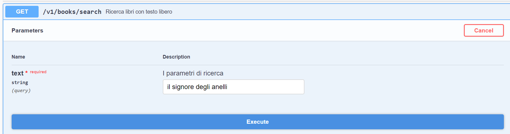
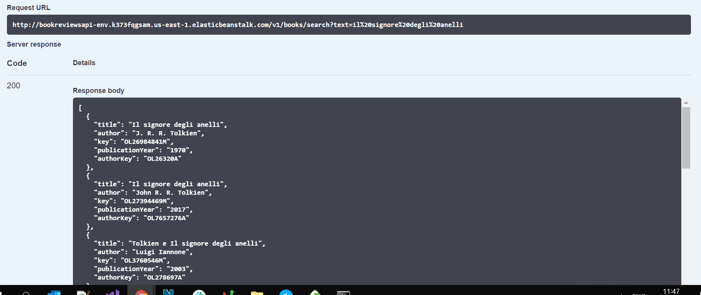
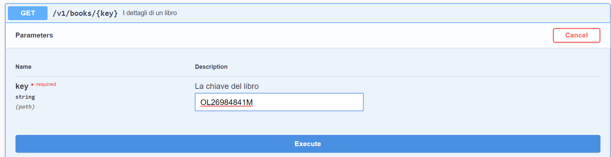
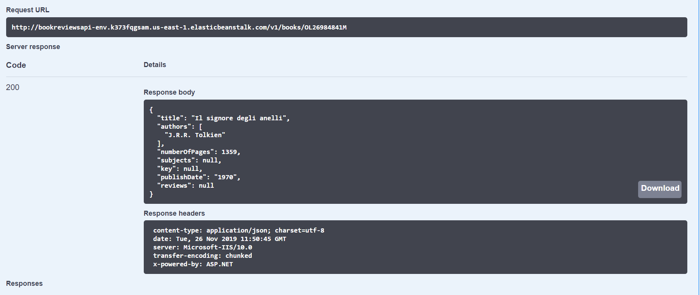
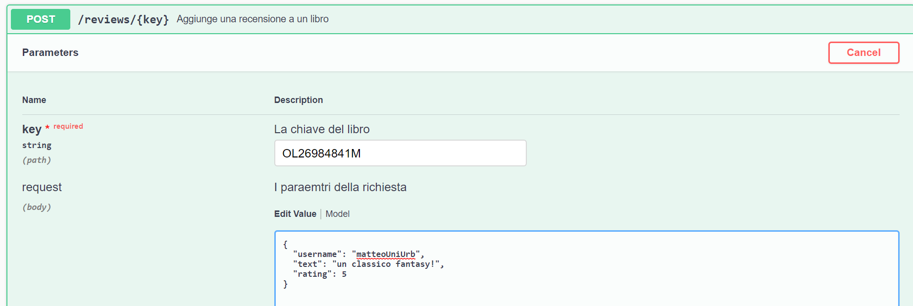
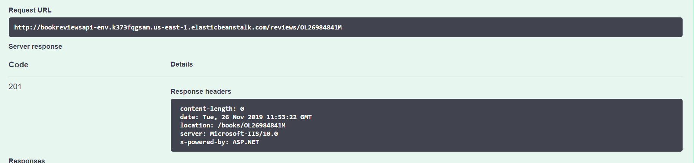
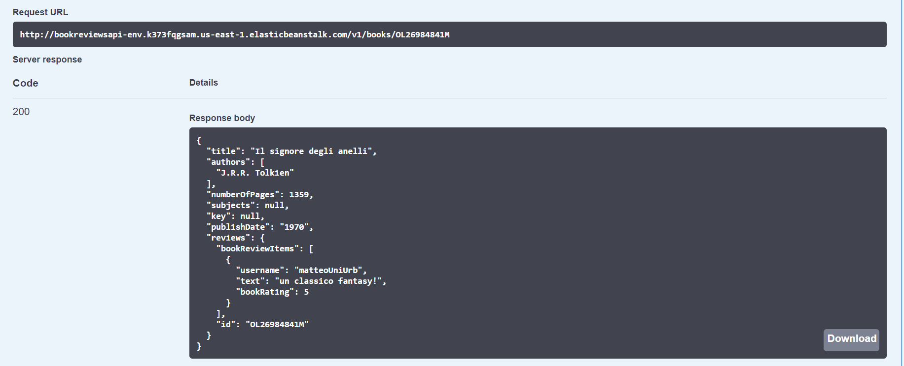

# Book Reviews

[](https://ci.appveyor.com/project/matteoUniUrb/bookreviews)

Una web API per ricercare libri e aggiungere recensioni. 

## Nome

Matteo Cunietti
 
## Matricola
270018


## Relazione

BookReviews é un set di web API che permette di effettuare una ricerca tra i libri di Open Library e di aggiungere recensioni degli utenti.

## Architettura e scelte implementative

L'applicazione é stata sviluppata su framework multi-platform `.NET Core 2.2`.

L'applicazione é sviluppata su 3 layer:

* `Controller`    => é l'entry point per ciascun endpoint. Questo strato applicativo invoca lo strato sottostante `Service`
* `Service`   => é lo strato dove é implementata la business logic. Nel nostro caso abbiamo l'invocazione HTTP delle API di OpenLibrary e l'invocazione dello strato sottostante di Repository per l'accesso al database LiteDB.
* `Repository`    => é lo strato di accesso al database dove vengono implementati i metodi di lettura/scrittura.

Per la comunicazione HTTP é stata utilizzata la classe `System.Net.Http.HttpClient` che gestisce la comunicazione socket internamente, e di cui abbiamo utilizzato il metodo `SendAsync` per la comunicazione con le OpenLibrary API. 

## Riferimento a servizi esterni utilizzati

### Open Library

L'applicazione utilizza `OpenLibrary`, una piattaforma `open` che ospita un catalogo di tutti i libri pubblicati (al momento ospitano 20 milioni di titoli).

Open Library permette la visualizzazione di tutte le pubblicazioni sul loro sito www.openlibrary.org ma espone anche delle API pubbliche e aperte per poter integrare il loro catalogo in applicazioni terze (per integrazione API vedere la pagina dedicata agli sviluppatori: https://openlibrary.org/developers).

Per l'applicazione Book Reviews vengono utilizzate le seguenti Open Library API:
* `Search` : per l'endpoint di ricerca libri => https://openlibrary.org/dev/docs/api/search
* `Books` : per l'endoint di recupero informazioni su un libro => https://openlibrary.org/dev/docs/api/books

## Database

Si é utilizzato per lo storage delle recensioni un database locale di semplice utilizzo, `LiteDB` (https://www.litedb.org/)

La configurazione attuale prevede che i dati vengano salvati su un file locale (`/Data/reviews.db`).

## Nuget packages

Sono stati utilizzati, oltre ai generici packages per Asp.Net core (configurazione, dependency injection, ecc) anche i seguenti Nuget packages, tutti scaricabili gratuitamente dalla piattaforma www.nuget.org :

* `AutoMapper` per la mappatura del contratto delle API di OpenLibrary e il contratto delle API di Book Reviews (https://automapper.org/).
* `SwashBuckle per .Net Core` per l'utilizzo di OpenApi e la generazione di documentazione delle API (https://docs.microsoft.com/en-us/aspnet/core/tutorials/getting-started-with-swashbuckle?view=aspnetcore-3.0&tabs=visual-studio). Questo package ha permesso:
    * La generazione automatica di una pagina di documentazione 
    * Un vero e proprio client online per utilizzare le API manualmente da interfaccia web 
    * Tramite l'integrazione della documentazione XML generata dalla compilazione del progetto sono esposte tutte le descrizioni dei parametri e dei tipi utilizzati dalle API
    * Tramite l'implementazione di classi di tipo `IExampleProvider` vengono visualizzati anche esempi `json` delle richieste e risposte in modo da permettere a sviluppatori di integrare agevolmente le API

## Documentazione API

Sono state implementati 3 endpoint:

* `GET   /v1/books/search` 
* `GET   /v1/books/{key}`   
* `POST  /v1/books/reviews/{key}`

### GET /v1/books/search
Ricerca libri con testo libero. Utilizza Open Library API
#### Request
Http method: `GET`

Accepts :  `application/json`

Parameters:
* `text` : *(string / querystring / required)* il testo da ricercare

#### Response
Status code:
* 200 OK 

Body:
``` [
  {
    "title": "string",
    "author": "string",
    "key": "string",
    "publicationYear": "string",
    "authorKey": "string"
  }
] 
```


### GET /v1/books/{key}
Recupera i dettagli di un libro. Utilizza Open Library API
#### Request
Http method: `GET`

Accepts :  `application/json`

Parameters:
* `key`: *(string / path / required)* la chiave primaria del libro

#### Response
Status code:
* 200 OK 

Body:
``` 
 {
  "title": "string",
  "authors": [
    "string"
  ],
  "numberOfPages": 0,
  "subjects": [
    "string"
  ],
  "key": "string",
  "publishDate": "string",
  "reviews": {
    "bookReviewItems": [
      {
        "username": "string",
        "text": "string",
        "bookRating": "OneStar"
      }
    ],
    "id": "string"
  }
}
```

### POST  /v1/books/reviews/{key}
Aggiunge una recensione a un libro (utilizza database locale LiteDB)
#### Request
Http method: `POST`

Accepts :  `application/json`

Parameters:
* `key`: *(string / path / required)* la chiave primaria del libro
* `username`: *(string / body / required)* lo username del recensore
* `text`: *(string / body / required)* il testo della recensione
* `rating`: *(string / body / required)* il rating (in formato int da 1 a 5 oppure in formato string "OneStar","TwoStars","ThreeStars","FourStars","FiveStars")

#### Response
Status code:
* 201 Created 

## Messa online dell'API

Per la messa online é stato utilizzata la piattaforma Amazon Web Services - BeanStalk, un servizio che permette un deploy veloce su piattaforma cloud (EC2).

Per maggiori informazioni su Amazon BeanStalk vedere https://docs.aws.amazon.com/elasticbeanstalk/latest/dg/Welcome.html 

Il servizio é ospitato su una istanza Windows/IIS.

Url del servizio: http://bookreviewsapi-env.k373fqgsam.us-east-1.elasticbeanstalk.com/swagger/index.html (swagger).

## Esempio di utilizzo del servizio web

L'utilizzo ideale delle API é sequenziale ed é il seguente:

1. Ricerca libera di libri
2. Visualizzazione dettaglio di un singolo libro
3. Aggiunta recensione al libro

### GET   /v1/books/search => ricerca libri a chiave libera

1. Aprire la pagina Swagger
2. Cliccare sul tasto `GET` dell'endpoint `GET /v1/books/search` ed espandere il pannello
3. Cliccare sul tasto `TRY OUT` sulla destra, viene cosí visualizzato il campo per la ricerca libera
4. Immettere un testo quale "il signore degli anelli" e premere su `EXECUTE`. 
5. Ottenete una risposta HTTP 200 OK e un contenuto in formato Json della risposta con un elenco di libri

### GET   /v1/books/{key} => richiesta dettaglio libro

1. Aprire la pagina Swagger
2. Cliccare sul tasto `GET` dell'endpoint `GET v1/books/{key}` ed espandere il pannello
3. Cliccare sul tasto `TRY OUT` sulla destra, viene cosí visualizzato il campo per l'immissione della chiave del libro
4. Dalla risposta alla chiamata al precedente endpoint (ricerca) copiate una chiave di un qualsiasi libro e incollatela nel campo chiave. Poi premete `EXECUTE`
5. Ottenete una risposta HTTP 200 OK e un contenuto in formato Json della risposta con il dettaglio del libro (con eventuali recensioni aggiunte).

### POST   /v1/books/reviews => aggiunta di una recensione

1. Aprire la pagina Swagger
2. Cliccare sul tasto `POST` dell'endpoint `POST /v1/books/reviews` ed espandere il pannello
3. Cliccare sul tasto `TRY OUT` sulla destra, vengono cosí visualizzato i campi della richiesta del libro. Un campo di testo e una parte in Json che rappresenta il body della richiesta da inviare.
4. Dalla risposta alla chiamata all'endpoint di ricerca copiate una chiave di un qualsiasi libro e incollatela nel campo chiave. Poi premete `EXECUTE`
5. Compilate i campi del body (`username`, `text`, `rating`). Rating accetta valori numerici da 1 a 4.
5. Ottenete una risposta HTTP 201 Created. La vostra recensione é stata aggiunta. Invocando di nuovo l'endpoint per il dettaglio libro dovreste ora vedere la vostra recensione.

## Client Swagger

### GET   /v1/books/search => ricerca libri a chiave libera

1. Apriamo l'endpoint di ricerca


2. Inseriamo in testo di ricerca ed eseguiamo premendo il tasto `Execute`



3. Otteniamo HTTP 200 OK con una lista di libri che soddisfano il criterio di ricerca nel body della risposta



### GET   /v1/books/{key} => richiesta dettaglio libro

1. Apriamo l'endpoint di dettaglio del libro


2. Inseriamo la chiave primaria del libro ed eseguiamo premendo il tasto `Execute`



3. Otteniamo HTTP 200 OK e i dettagli del libro nel body della risposta




### POST   /v1/books/reviews => aggiunta di una recensione

1. Apriamo l'endpoint di aggiunta di una recensione


2. Inseriamo la chiave primaria del libro e i dettagli della recensione, poi premiamo `Execute`



3. Otteniamo HTTP 201 Created 



### Controllo della nuova recensione

1. Apriamo l'endpoint di dettaglio del libro a cui abbiamo appena aggiunto una recensione e otteniamo il seguente risultato



Con la nostra recensione aggiunta al dettaglio del libro!